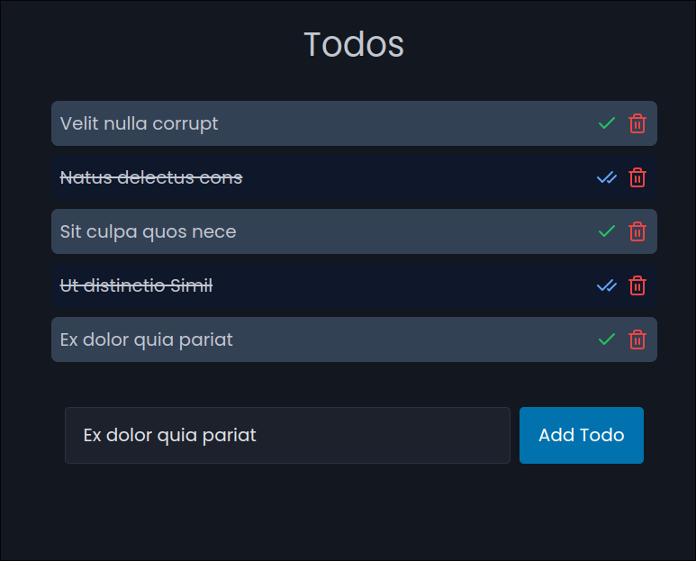

# Todo App



## Tech Stack

- Templ : [https://templ.guide](https://templ.guide)
  Used for creating components
- HTMX : [https://htmx.org](https://htmx.org)
  Used it since twitter couldn't stop talking about it
- Tailwind : [https://tailwindcss.com](https://tailwindcss.com)
  I mean does it even need a reason to be used
- Picocss : [https://picocss.com](https://picocss.com)
  I am lazy so i cheated a bit

## Installation

Make sure you have the following dependencies installed:

- go(I don't have any idea what version should be. The more the better. I have used 1.22.5)
- tailwindcss(Same as above. I have used 3.4.7)

Step 1: Clone this repo

```sh
git clone https://github.com/vivalchemy/todo-templ-htmx.git
```

Step 2: Cd into the repo

```sh
cd todo-templ-htmx
```

Step 3: Install the go dependencies

```sh
go mod download
```

Step 4: Define the environment variables

```sh
mv .env.example .env
```

Step 5: Run the server

```sh
make live
make live/preview
```

Step 6: Open the browser and navigate to [http://localhost:3000](http://localhost:3000)

(I use air so don't pounce on me for this weird naming)

## Contributing

I mean really?
Well if you can install this you can contribute to it(please don't).
